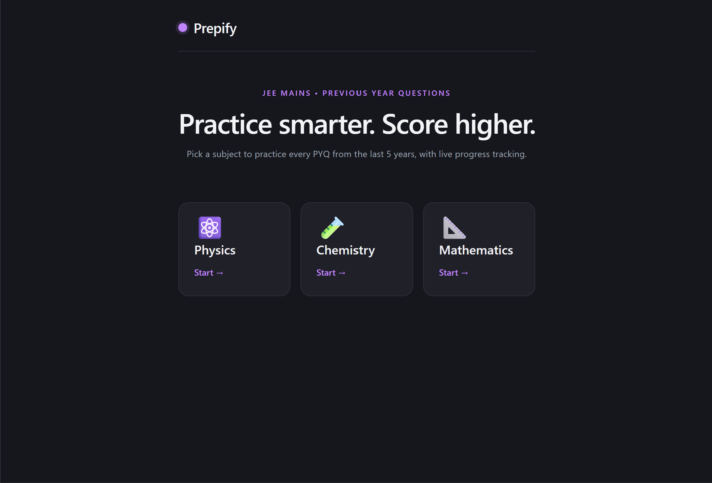
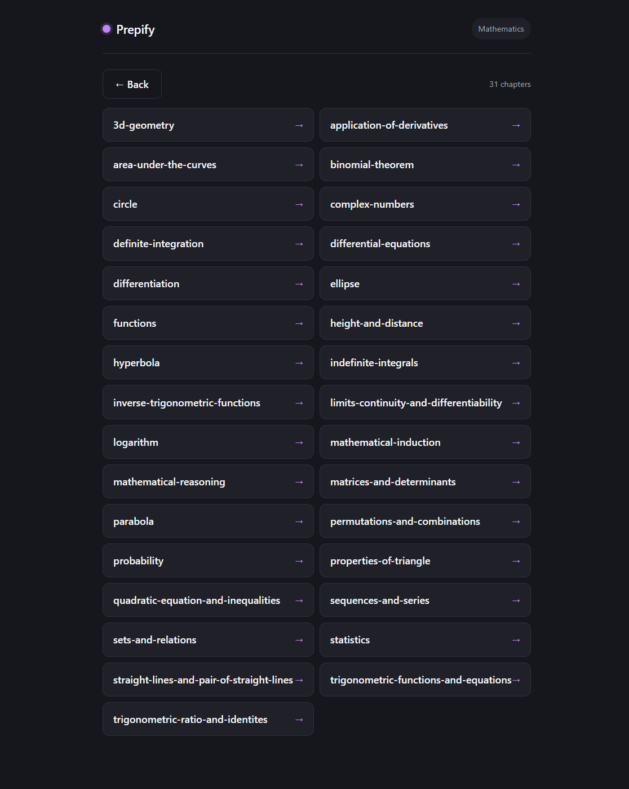
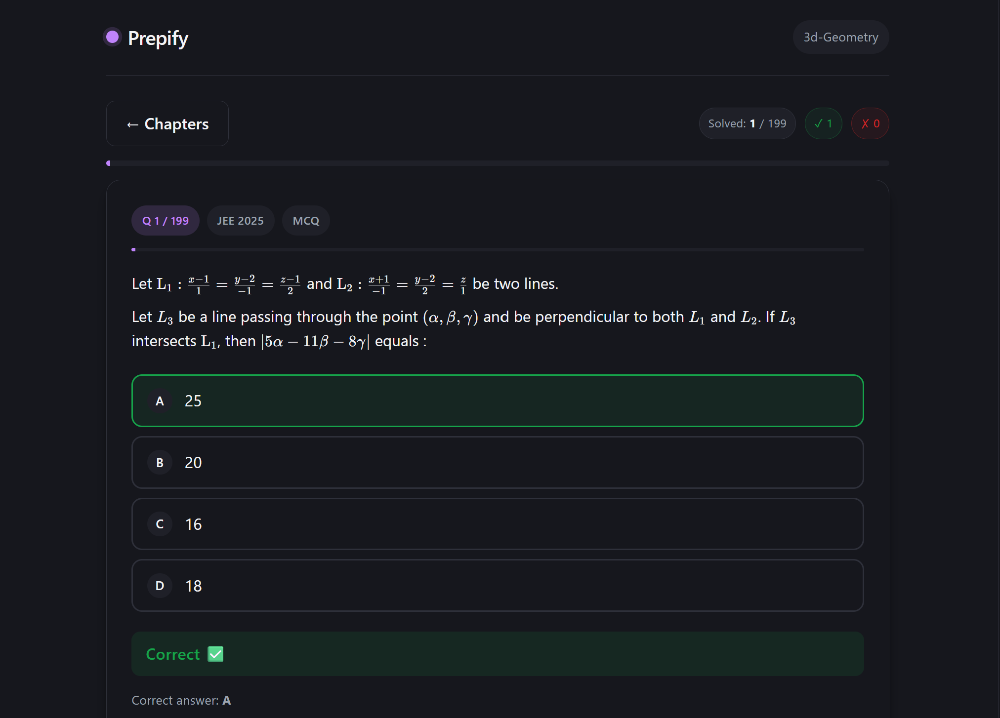

# Prepify — JEE Mains PYQ Solver
A minimal web app to browse and solve **JEE Mains Previous Year Questions** chapter‑wise, with proper LaTeX rendering for math and chemistry.
Built on top of the [`jee_mains_pyqs_data_base`](https://github.com/HostServer001/jee_mains_pyqs_data_base) — a dataset of **14,000+ JEE Mains PYQs**. Prepify surfaces the **most recent 5 years** of questions per chapter, so practice stays aligned with current paper trends.
---
## Features
- **Subject → Chapter → Questions** flow (Physics, Chemistry, Mathematics)
- **Last 5 years** of JEE Mains PYQs per chapter
- **MCQ + Numerical** question types
- **LaTeX rendering** via KaTeX (`$...$`, `$$...$$`, `\[...\]`, `\(...\)`)
- Instant answer check + explanation reveal
- Clean light/dark UI driven by CSS variables
---
## Tech Stack
**Frontend**
- React (Vite) + `html-react-parser`
- KaTeX (`auto-render`) for math
- Plain CSS with design tokens (`index.css` / `App.css`)
**Backend**
- FastAPI (Python) — serves `/subjects`, `/chapters/{subject}`, `/questions/{chapter}`
- CORS enabled for the Vite dev origin (`http://localhost:5173`)
- Powered by the `jee_data_base` package (`DataBase`, `Filter`)
---
## Project Structure
```
prepify/
├─ backend/
│  └─ main.py              # FastAPI app
└─ frontend/
   ├─ src/
   │  ├─ App.jsx           # Subjects → Chapters → Questions UI
   │  ├─ App.css           # Component styles
   │  ├─ index.css         # Theme tokens (light + dark)
   │  └─ main.jsx
   └─ package.json
```
---
## Running Locally
### 1. Backend (FastAPI)
```bash
pip install fastapi uvicorn jee_data_base
uvicorn main:app --reload --port 8000
```
The first boot prints `Loading JEE Database...` while the dataset is loaded into memory.
### 2. Frontend (Vite)
```bash
npm install
npm run dev
```
Open <http://localhost:5173>. The frontend talks to `http://127.0.0.1:8000` (see `API_BASE` in `App.jsx`).
---
## Why It's Not Deployed
The `jee_data_base` package loads the **entire question bank into memory** at startup. Once loaded, the process easily crosses Render's **free‑tier 512 MB RAM limit**, so the backend gets OOM‑killed on boot.
For now Prepify runs **locally only** — screenshots below show it working end‑to‑end on a local machine. A deployable version would need either:
- a paid tier with more RAM, or
- migrating the dataset to an on‑disk store (SQLite / Postgres) so it isn't fully resident in memory.
---
## API
| Method | Endpoint | Description |
| ------ | -------- | ----------- |
| GET | `/` | Health check |
| GET | `/subjects` | List of subjects |
| GET | `/chapters/{subject}` | Chapters for a subject |
| GET | `/questions/{chapter}` | Last 5 years of PYQs for a chapter |
---
## Screenshots
<!-- Add your 4 screenshots here -->




---
## Credits
- Question dataset: [HostServer001/jee_mains_pyqs_data_base](https://github.com/HostServer001/jee_mains_pyqs_data_base)
- Math rendering: [KaTeX](https://katex.org/)
